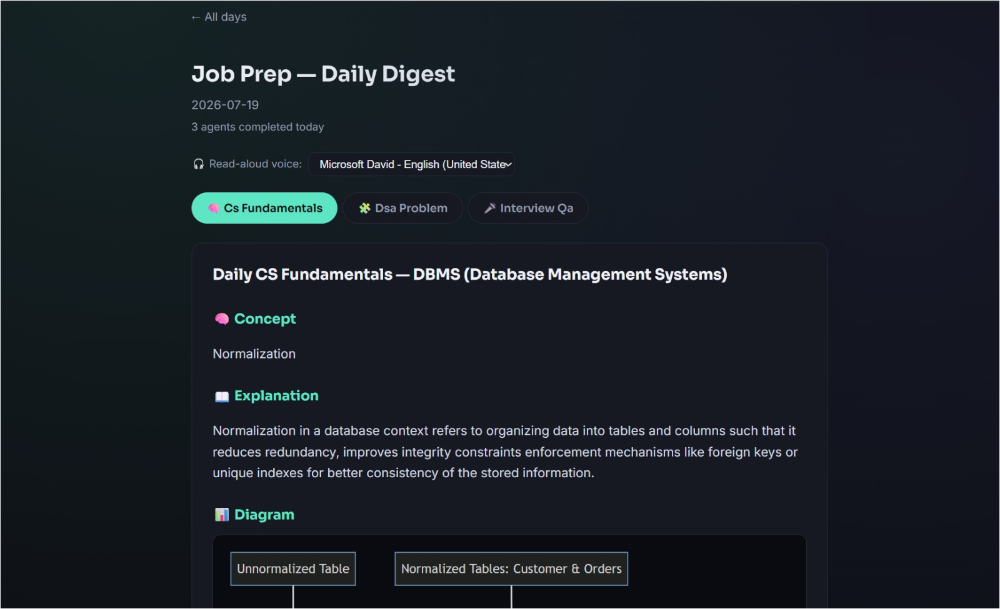
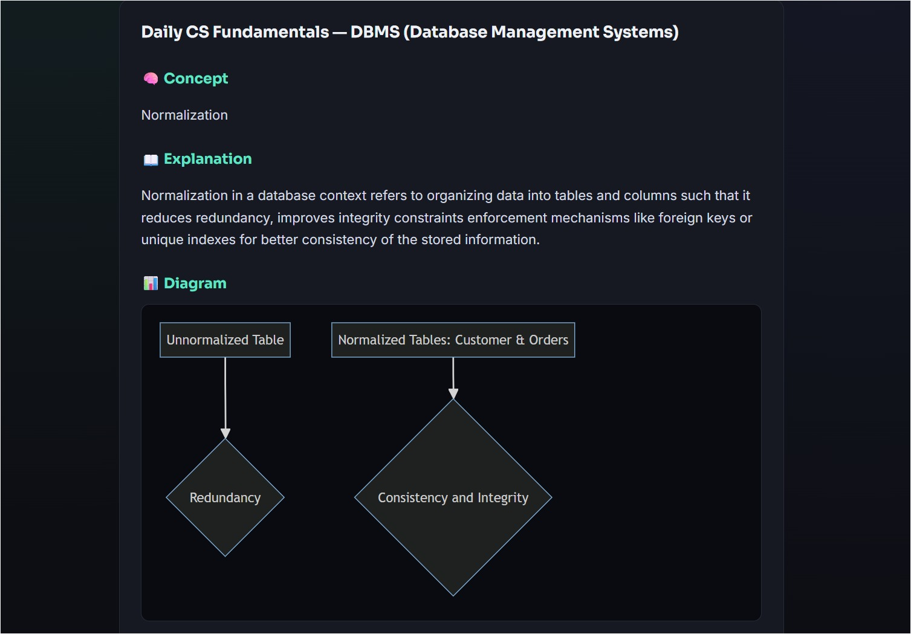
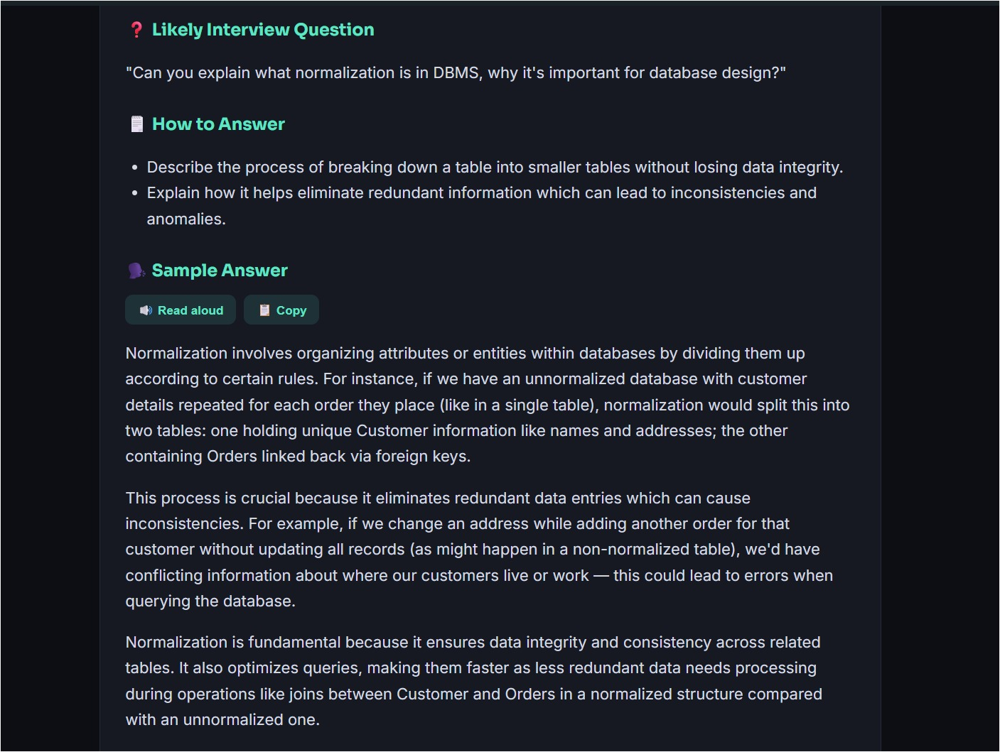
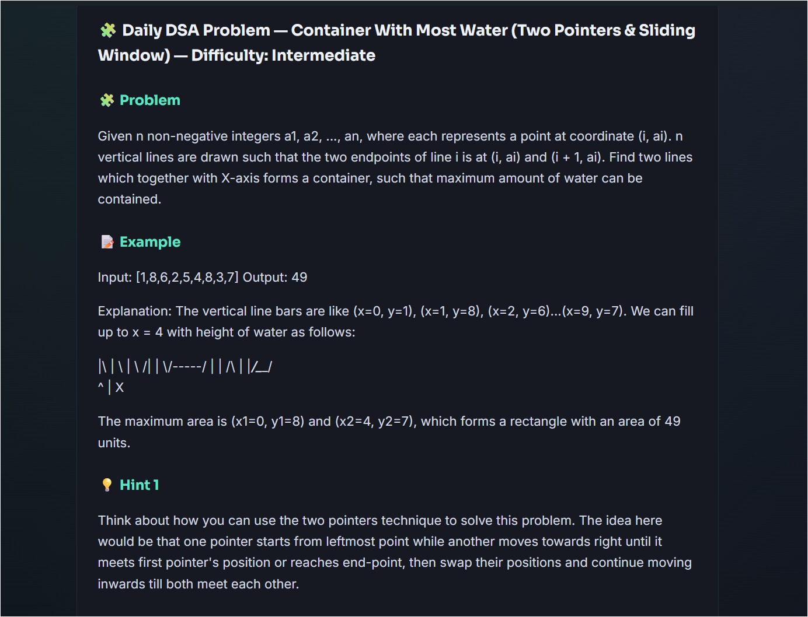
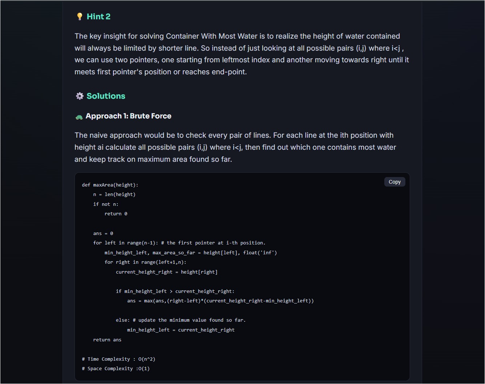
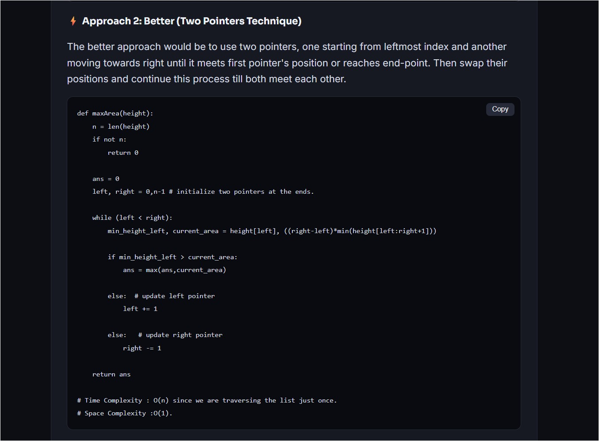
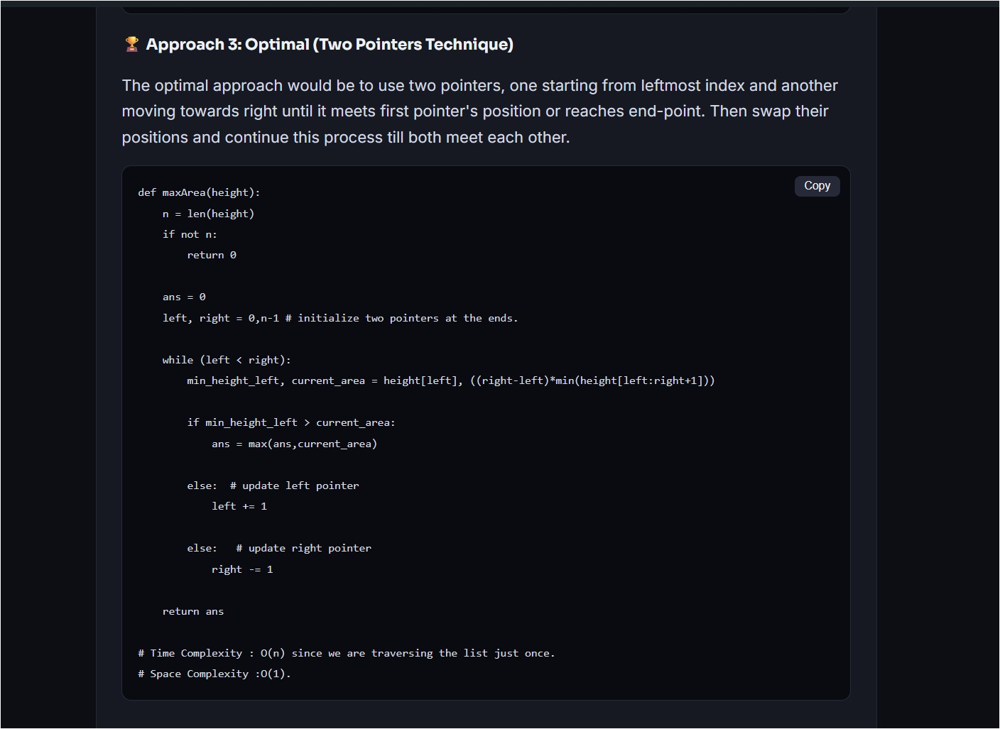
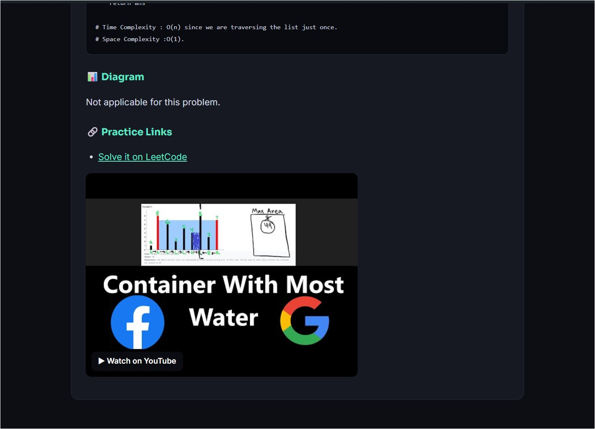
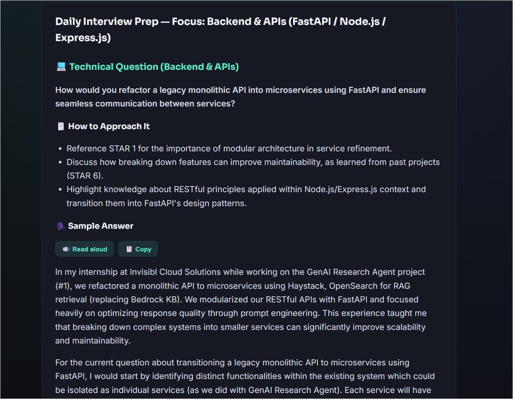
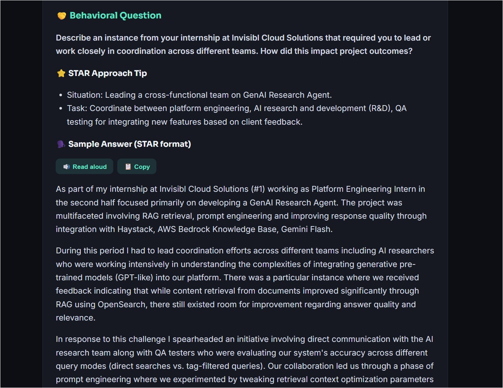

# Job Prep Agents

My real, working daily AI job-prep setup — a local LLM (via [Ollama](https://ollama.com))
generates a fresh DSA problem, CS fundamentals concept, and tailored interview
Q&A every morning, scheduled to run automatically. No per-call API costs,
nothing sent to third parties (except the optional job-digest agent, which
uses Ollama's hosted search, plus DuckDuckGo/YouTube lookups for links/videos).

**Tested and running on:** Windows 11, GTX 1050 (4GB VRAM), `phi4-mini` via
Ollama, Ollama's hosted web search API, and the YouTube Data API for embedded
videos.

> Want a version you can configure with your own background and choice of
> LLM provider (including hosted APIs like Groq/Mistral/Gemini, not just
> Ollama)? See **[job-prep-agents-customizable](your-customizable-repo-url)**
> — the generalized version of this same project.

> Inspired by freeCodeCamp's
> ["How to Build and Schedule Local AI Assistants for Daily Tasks"](https://www.freecodecamp.org/news/how-to-build-and-schedule-local-ai-assistants-for-daily-tasks/).

## Screenshots

### Tabs :



### CS Fundamentals :




### DSA Problem :







### Interview QA :




## What it does

Every morning, it prepares:

- A real LeetCode problem (Beginner/Intermediate/Advanced, with hints, three
  solution tiers, a diagram, and a real LeetCode + YouTube link)
- A CS fundamentals concept (with a diagram and live further-reading links)
- A tailored interview Q&A, grounded in my actual projects and past interview questions
- (Mon & Thu) A digest of fresh job postings matching my target roles

...shown in a clean local web page, with a desktop notification when it's ready.

## Features

- Fully local LLM inference via Ollama — no data leaves the machine (except
  the optional live-search features noted above)
- One scheduled task, smart daily rotation (each agent declares which
  weekdays it runs)
- No-repeat memory — every agent tracks what it's already covered
- Real, curated DSA problems (not AI-invented) with tiered solutions and a
  Mermaid diagram of the optimal approach
- Live "Further Reading" links for CS concepts, fetched via DuckDuckGo
- Voice read-aloud for sample interview answers, with a voice picker
- A tabbed, dark-themed local web viewer + native popup notification

## How it works (architecture)

```
job-prep-agents/
├── scheduler.py           # loads every agent, runs what's due today, builds the viewer
├── run_scheduler.bat      # Windows Task Scheduler entry point
├── notify.ps1             # native popup notification window
├── .env.example           # copy to .env — your model/API-key settings
├── config/
│   └── profile.py         # my real background/projects/target roles
├── outputs/                # generated each run: viewer-YYYY-MM-DD.html + raw .md files
├── history/                # auto-tracked: what's already been covered per agent
└── agents/
    ├── _history.py         # shared no-repeat tracking helper
    ├── _websearch.py        # shared DuckDuckGo lookup helper (graceful fallback)
    ├── dsa_problem.py        # curated real LeetCode problems + tiered solutions
    ├── cs_fundamentals.py    # rotating OS/DBMS/CN/OOP/System Design concepts
    ├── interview_qa.py       # tailored + generic interview Q&A
    └── job_digest.py         # Mon & Thu: job postings matching my target roles
```

Every agent is a Python file with a `NAME` and a `run()` that returns
Markdown. `scheduler.py` just discovers and runs everything in `agents/`.

### The "calendar" — one scheduled task, not four

Each agent declares which weekdays it runs via a `SCHEDULE` set (`0`=Monday
... `6`=Sunday); no attribute means "every day." `dsa_problem`,
`cs_fundamentals`, `interview_qa` run daily; `job_digest` runs Mon/Thu.

## Setup (Windows)

### 1. Install Ollama and pull a model

```powershell
ollama pull phi4-mini
```

> **VRAM/context-window note:** some models default to a huge context
> window, which can force far more memory allocation than the model's file
> size suggests — sometimes overflowing a small GPU into slow CPU inference.
> This project caps context via `num_ctx=4096` in every agent. If things run
> slowly, run `ollama ps` — if `PROCESSOR` isn't close to 100% GPU, the
> model/context is too big for your VRAM.

### 2. Clone and set up a virtual environment

```powershell
git clone <this-repo-url>
cd job-prep-agents
python -m venv .venv
.venv\Scripts\activate
pip install -r requirements.txt
```

### 3. Configure your environment

```powershell
copy .env.example .env
```

Fill in `.env`:

- `OLLAMA_MODEL` — the model you pulled
- `OLLAMA_API_KEY` _(optional)_ — only needed for `job_digest`. Get one at
  https://docs.ollama.com/api/authentication
- `YOUTUBE_API_KEY` _(optional)_ — enables real embedded videos for DSA
  problems. Get a free key via Google Cloud Console (enable YouTube Data API v3).

### 4. Test it manually

```powershell
python scheduler.py
```

Watch for `[run]`/`[ok]` lines. When it finishes, your browser should
auto-open to `outputs/viewer-<today>.html`, and a popup notification appears.

### 5. Point `run_scheduler.bat` at your project

Edit the two paths in `run_scheduler.bat` (project folder + venv's
`python.exe`), then test:

```powershell
.\run_scheduler.bat
```

Check `runner.log` for the same output as step 4.

### 6. Schedule it with Windows Task Scheduler

```powershell
schtasks /Create /SC DAILY /TN "Job Prep Agents" /TR "D:\full\path\to\job-prep-agents\run_scheduler.bat" /ST 10:30 /RL HIGHEST
```

Verify anytime:

```powershell
schtasks /Query /TN "Job Prep Agents" /V /FO LIST
```

Check the **Last Result** field — `0` means success.

## Customization guide

| Want to change...                                  | Edit this file                                  |
| -------------------------------------------------- | ----------------------------------------------- |
| Background, projects, target roles, past questions | `config/profile.py`                             |
| Which DSA problems are covered / their difficulty  | `agents/dsa_problem.py` → `PROBLEM_BANK`        |
| Which CS topics rotate through                     | `agents/cs_fundamentals.py` → `TOPICS`          |
| Which interview focus areas show up                | `agents/interview_qa.py` → `FOCUS_AREAS`        |
| Job search queries                                 | `config/profile.py` → `JOB_SEARCH_QUERIES`      |
| Which days an agent runs                           | that agent's `SCHEDULE` set                     |
| The model / API keys                               | `.env`                                          |
| The look of the viewer page                        | `scheduler.py` → `PAGE_STYLE` / `VIEWER_SCRIPT` |

## Troubleshooting

<details>
<summary>Scheduler hangs for minutes with no output</summary>

Almost always Ollama loading the model into memory for the first time (or
after being idle) — not actually stuck. Check `ollama ps`. Set
`OLLAMA_KEEP_ALIVE=30m` in `.env` so repeated runs stay fast.

</details>

<details>
<summary>ollama ps shows a huge memory size / mostly CPU, not GPU</summary>

The model's default context window is likely bigger than your VRAM can hold.
This project caps `num_ctx=4096` in every agent already.

</details>

<details>
<summary>Batch file errors with garbled paths</summary>

The **entire path** needs to be inside one pair of quotes. Wrong:
`cd /d C:\"My Folder"\project`. Right: `cd /d "C:\My Folder\project"`.

</details>

<details>
<summary>Windows Task Scheduler: task exists but "Last Result" isn't 0</summary>

`-2147024891` (0x80070005) is "Access Denied" — a Task-Scheduler-specific
permissions issue, not a script bug (especially if double-clicking the
`.bat` directly works fine). Try recreating the task with `/RL HIGHEST`, and
check Windows Security → Virus & threat protection → Controlled folder
access, which sometimes blocks non-interactively-triggered scripts.

</details>

<details>
<summary>Embedded YouTube video shows "Error 153"</summary>

That's YouTube's error for "video owner disabled embedding elsewhere." This
project uses a clickable thumbnail + link instead of an `<iframe>`, which
works regardless of embed permissions.

</details>

<details>
<summary>Mermaid diagram shows a "bomb icon" / syntax error</summary>

Small local models occasionally produce invalid Mermaid syntax. The viewer
validates syntax before rendering and shows a clean "Diagram unavailable"
message instead.

</details>

## A note on trust

Small local models still hallucinate — spot-check DSA solutions, job
postings, and technical explanations before trusting them fully. Treat this
as a study nudge and starting point, not gospel.

## License

[MIT](LICENSE) — free to use, modify, and redistribute.
